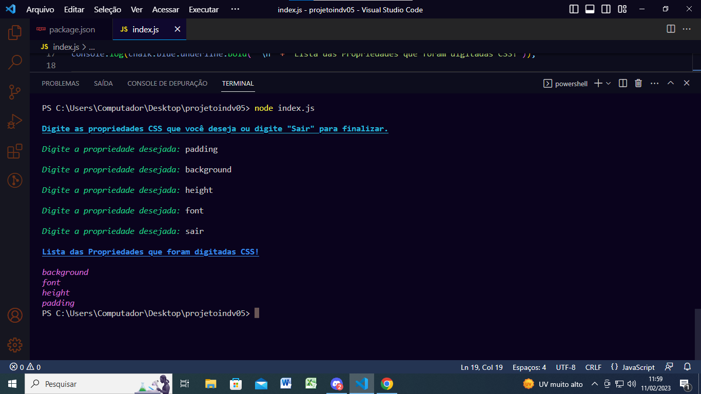

# Projeto projetoindv05 🥰

<br >

## Proposta do projeto 😊

- Usar o Node para montar um código que vai receber uma lista de
  propriedades de CSS (ex:color, font, width) e vai devolver
  essa lista ordenada de A-Z.

- Ordenar o CSS ajuda a encontrar mais rápido a
  propriedade que precisamos alterar.

- O código deve rodar em um laço que vai receber propriedades até a
  pessoa digitar a palavra “Sair”, quando isso acontecer vai ser impresso
  no terminal a lista das propriedades ordenadas de A-Z uma em cada linha.

## Depedências utilizadas 👩‍💻

[readlineSync](https://www.npmjs.com/package/readline-sync) Execução interativa para conversar com o usuário por meio de um console.

[chalk](https://www.npmjs.com/package/chalk) É usado para estilizar o formato do texto e a cor nos projetos  node.js

<br>

<br>


## Resultado 😌



<br>


## instruções para uso👇

###### Instale as dependências

```bash
  npm install readline-sync
```

```bash
  npm install chalk
```


###### Abra o terminal e digite

```bash
node index.js
```
<br>
<br>

#### Feito por  ❤️

> Juliana Rodrigues Nogueira
<br>

[](https://github.com/rodrigues28ju)
[](https://www.linkedin.com/julianarodriguesnogueira)
